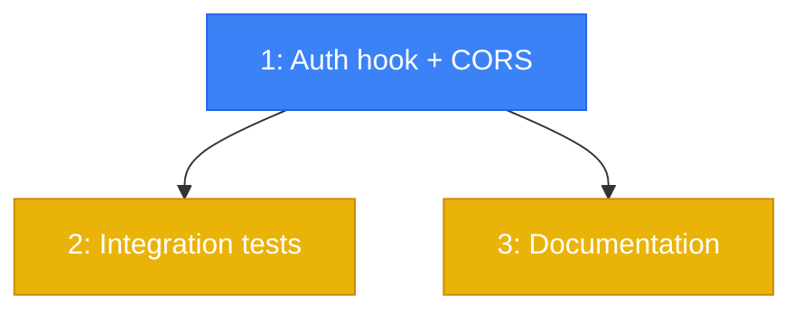

# PLAN: Basic API Auth for Engine REST Endpoints

## Status

Draft

## Scope Summary

Add bearer token auth hook and CORS restriction to the webhook server.
10 new tests. Documentation update.

## Decomposition Strategy

**Horizontal decomposition.** Single file change for the auth hook + CORS,
then tests, then docs. Clean layer-by-layer build with no integration risk.

## Issue Outlines

### Issue 1: feat(core): add API auth hook and CORS restriction

**Complexity:** testable
**Complexity rationale:** Security-critical auth logic with path exclusions, constant-time comparison, and CORS configuration changes.

#### Goal

Add `registerApiAuth()` method to WebhookServer that registers a Fastify
`onRequest` hook validating `Authorization: Bearer <token>` on `/api/*`
routes when `ENGINE_API_TOKEN` is set. Update the constructor to call
`registerApiAuth()` before `registerRateLimiting()`. Update CORS to read
`CORS_ORIGIN` env var.

#### Acceptance Criteria

- [ ] `registerApiAuth()` method added to WebhookServer
- [ ] Hook registered between request tracking and rate limiting in constructor
- [ ] All `/api/*` and `/v1/api/*` routes require bearer token when `ENGINE_API_TOKEN` is set
- [ ] Requests without valid token receive 401 `{ "error": "Unauthorized" }`
- [ ] Malformed Authorization headers (no Bearer prefix, empty token) return 401
- [ ] Token compared via SHA-256 hash + `timingSafeEqual` (no length oracle)
- [ ] Excluded paths: `/webhooks/*`, `/health`, `/.well-known/agent.json`, OAuth install/callback routes
- [ ] When `ENGINE_API_TOKEN` is unset, no hook registered, all requests pass through
- [ ] Startup log: `"API auth enabled"` when token set, `"API routes are unauthenticated"` when not
- [ ] CORS uses `CORS_ORIGIN` when set (string or comma-separated array), `true` when unset
- [ ] Startup log warns when `CORS_ORIGIN` is not set
- [ ] TypeScript compiles without errors
- [ ] All existing tests pass

#### Dependencies

None

---

### Issue 2: test(core): add API auth integration tests

**Complexity:** testable
**Complexity rationale:** 10 tests verifying security-critical auth behavior.

#### Goal

Write `packages/core/src/server/__tests__/api-auth.test.ts` with 10 tests
covering auth enforcement, exclusions, opt-in behavior, and CORS.

#### Acceptance Criteria

- [ ] Test: `/api/agents` returns 401 without Authorization header
- [ ] Test: `/api/agents` returns 401 with wrong token
- [ ] Test: `/api/agents` returns 401 with malformed header (no Bearer prefix)
- [ ] Test: `/api/agents` succeeds with correct Bearer token
- [ ] Test: `/webhooks/github` not affected by auth
- [ ] Test: `/health` not affected by auth
- [ ] Test: `/api/slack/callback` not affected by auth
- [ ] Test: `/api/events` (SSE) requires token
- [ ] Test: Auth disabled when `ENGINE_API_TOKEN` unset
- [ ] Test: Token hash comparison prevents length oracle
- [ ] All 10 new tests pass
- [ ] All pre-existing tests unaffected

#### Dependencies

Issue 1

---

### Issue 3: docs(config): document ENGINE_API_TOKEN and CORS_ORIGIN

**Complexity:** simple
**Complexity rationale:** Documentation update to existing pages.

#### Goal

Update configuration and security documentation to cover `ENGINE_API_TOKEN`,
`CORS_ORIGIN`, excluded paths, and operational considerations (token
rotation, SSE lifecycle).

#### Acceptance Criteria

- [ ] Doc explains `ENGINE_API_TOKEN` (opt-in, bearer token on `/api/*`)
- [ ] Doc explains `CORS_ORIGIN` (single origin or comma-separated, defaults to allow-all)
- [ ] Doc lists excluded paths (webhooks, health, OAuth callbacks)
- [ ] Doc mentions operational notes: token rotation requires restart, SSE connections persist
- [ ] Doc recommends `openssl rand -hex 32` for token generation

#### Dependencies

Issue 1

## Dependency Graph

**Legend:** Blue = ready to start, Yellow = blocked by dependency

## Implementation Sequence

**Critical path:** Issue 1 (auth hook) -> Issue 2 (tests)

**Parallelization:** After Issue 1, Issues 2 and 3 can run in parallel.

**Estimated scope:** ~60 lines new code, ~200 lines tests, ~50 lines docs.
