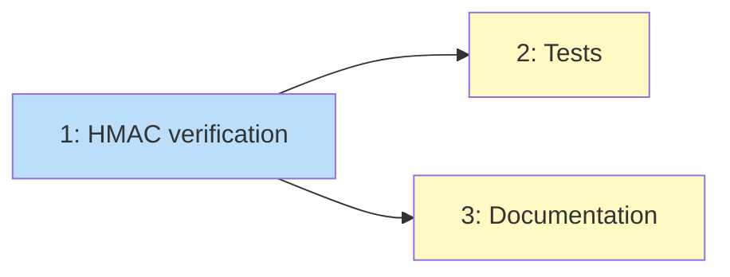

# PLAN: Deploy Webhook Authentication

## Status

Draft

## Scope Summary

Add HMAC-SHA256 signature verification to the generic deploy webhook handler,
following the same pattern as the Vercel and Sentry handlers. Includes tests and
documentation updates.

## Decomposition Strategy

**Horizontal.** The components have clear boundaries: handler code, tests, and
docs. The handler change is the foundation that tests and docs describe. No
walking skeleton needed -- there's no end-to-end integration risk since the
verification pattern is already proven in three other handlers.

## Issue Outlines

### Issue 1: Add HMAC-SHA256 verification to deploy webhook handler

**Complexity:** testable

**Goal:** Wire the shared `verifyWebhookSignature()` and `enforceWebhookSecret()`
functions into the deploy webhook handler, following the same inline pattern as
the Sentry and Vercel handlers.

**Files to modify:**
- `packages/core/src/server/routes/webhooks.ts` -- add verification preamble to
  the deploy handler route (~15 lines before existing business logic)
- `packages/core/src/server/routes/webhooks.ts` -- update `GET /api/webhooks/url`
  response with deploy secret configuration instructions

**Implementation details:**
1. Resolve secret: org channel config storage (key `"deploy"`) then
   `DEPLOY_WEBHOOK_SECRET` env var
2. Call `enforceWebhookSecret(secret, "Deploy", reply, log)`
3. If secret exists: read `x-deploy-signature` header, reject 401 if missing
4. Serialize body: `typeof request.body === "string" ? request.body : JSON.stringify(request.body)`
5. Call `verifyWebhookSignature(rawBody, signature, secret, "sha256")`, reject 401
   if false
6. Update webhook URL response to include `secretEnvVar: "DEPLOY_WEBHOOK_SECRET"`
   and `signatureHeader: "x-deploy-signature"` for the deploy entry

**Acceptance criteria:**
- [ ] Deploy handler resolves secret from org storage then DEPLOY_WEBHOOK_SECRET env var
- [ ] Valid HMAC-SHA256 signature in x-deploy-signature header returns 200
- [ ] Invalid signature returns 401
- [ ] Missing signature when secret is configured returns 401
- [ ] No secret + non-strict mode accepts request with warning log
- [ ] No secret + strict mode rejects with 401
- [ ] GET /api/webhooks/url includes deploy secret setup instructions
- [ ] Existing business logic (audit, broadcast, alert handler) unchanged

**Dependencies:** None

### Issue 2: Add tests for deploy webhook authentication

**Complexity:** testable

**Goal:** Integration tests that verify all signature verification paths using the
real `WebhookServer.inject()` method, not duplicated hook logic.

**Files to create:**
- `packages/core/src/server/__tests__/deploy-webhook-auth.test.ts`

**Test cases:**
1. Valid signature accepted (200)
2. Invalid signature rejected (401)
3. Missing x-deploy-signature header rejected (401) when secret configured
4. No secret + non-strict mode accepts unsigned request (200)
5. No secret + strict mode rejects unsigned request (401) -- use
   `vi.resetModules()` for fresh module import
6. GET /api/webhooks/url includes deploy instructions

**Implementation details:**
- Use real `WebhookServer` with `inject()` (same pattern as `api-auth.test.ts`)
- For strict mode test: `vi.resetModules()` to get fresh `WEBHOOK_STRICT_MODE` read
- Compute test signatures with `createHmac("sha256", secret).update(body).digest("hex")`

**Acceptance criteria:**
- [ ] All 6 test cases pass
- [ ] Tests use real WebhookServer.inject(), not mocked middleware
- [ ] Strict mode test uses vi.resetModules() for module-level env var
- [ ] Tests run from repo root: `npx vitest run --root .`

**Dependencies:** <<ISSUE:1>>

### Issue 3: Update documentation

**Complexity:** simple

**Goal:** Update the webhook monitoring guide and security docs to cover the
deploy webhook secret configuration.

**Files to modify:**
- `apps/docs/content/docs/guides/webhook-monitoring.mdx` -- add deploy webhook
  secret to the configuration table and setup instructions
- `apps/docs/content/docs/configuration/security.mdx` -- add deploy webhook to
  the security checklist

**Acceptance criteria:**
- [ ] Webhook monitoring guide documents DEPLOY_WEBHOOK_SECRET env var
- [ ] Webhook monitoring guide documents x-deploy-signature header convention
- [ ] Webhook monitoring guide includes a signing example (bash curl)
- [ ] Security checklist includes deploy webhook secret item

**Dependencies:** <<ISSUE:1>>

## Dependency Graph

**Legend**: Blue = ready, Yellow = blocked

## Implementation Sequence

**Critical path:** Issue 1 (handler change) -> Issue 2 (tests) -> Issue 3 (docs)

Issues 2 and 3 are independent of each other and can run in parallel after Issue 1
completes. In practice, with single-pr execution, they'll run sequentially but the
total is small (~30 minutes of implementation work).
