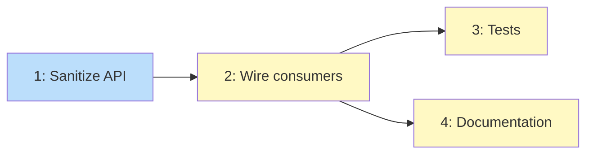

# PLAN: Extend Prompt Guard to Indirect Sources

## Status

Draft

## Scope Summary

Add a `sanitize()` method to PromptGuard that redacts injection patterns from
untrusted content, wire it into the three sites where external content enters
Claude prompts (ReviewAgent, SmartAlert, SmartResponder), and log every
screening event to the audit trail.

## Decomposition Strategy

**Horizontal.** The sanitize API is a prerequisite for all consumers. Once it
exists, the three consumer sites are independent of each other. Tests and docs
depend on the consumer wiring being complete.

## Issue Outlines

### Issue 1: Add sanitize method and audit helper to PromptGuard

**Complexity:** testable

**Goal:** Add a `sanitize(text, source)` method to `PromptGuard` that runs
`analyze()` on the input and, if any patterns trigger, redacts the matched
portions. Also add a helper that logs flagged content to the audit trail.

**Files to modify:**
- `packages/core/src/security/prompt-guard.ts` -- add `sanitize()` method and
  `ContentSource` type

**Implementation details:**

1. Add a `ContentSource` type: `"pr_title" | "pr_diff" | "commit_message" | "ci_error" | "audit_context" | "deploy_data"`

2. Add `sanitize(text: string, source: ContentSource): SanitizeResult` to the
   `PromptGuard` class:
   - Run `analyze(text)` on the input
   - If no triggers, return `{ text, flagged: false, analysis }`
   - If triggers fire, replace each pattern match with
     `[redacted: <rule-id>]` and return `{ text: redactedText, flagged: true, analysis }`

3. Export a standalone `sanitizeForPrompt(text: string, source: ContentSource, guard?: PromptGuard): SanitizeResult`
   convenience function that uses the default singleton

4. The `SanitizeResult` interface:
   ```typescript
   interface SanitizeResult {
     text: string;
     flagged: boolean;
     source: ContentSource;
     analysis: PromptAnalysis;
   }
   ```

**Acceptance criteria:**
- [ ] `sanitize()` returns unmodified text when no patterns trigger
- [ ] `sanitize()` replaces pattern matches with `[redacted: <rule-id>]` placeholders
- [ ] `sanitize()` returns the full `PromptAnalysis` for audit logging
- [ ] `sanitizeForPrompt()` convenience function works with default singleton
- [ ] Multiple patterns in the same text are all redacted independently

**Dependencies:** None

### Issue 2: Wire guard into ReviewAgent, SmartAlert, and SmartResponder

**Complexity:** testable

**Goal:** Apply `sanitizeForPrompt()` to all untrusted fields before they enter
Claude prompts at the three consumer sites. Log flagged content to audit trail.

**Files to modify:**
- `packages/agents/review/src/review-agent.ts` -- sanitize PR title and each
  diff patch in `analyzeWithClaude()`
- `packages/core/src/ai/smart-alert.ts` -- sanitize commit message and error
  message in `analyzeDeployFailure()`
- `packages/core/src/ai/smart-responder.ts` -- sanitize audit detail fields,
  commit messages, and deploy data in system prompt construction

**Implementation details:**

**ReviewAgent** (`analyzeWithClaude`):
- Sanitize `prTitle` before interpolation into the prompt (line 306)
- Sanitize each `f.patch` before inclusion in `diffContext` (line 288)
- If any field is flagged, log to audit trail via storage

**SmartAlert** (`analyzeDeployFailure`):
- Sanitize `alert.commitMessage` and `alert.errorMessage` before prompt
  interpolation (lines 34-35)
- Accept an optional `StorageProvider` parameter for audit logging (or use a
  callback pattern)

**SmartResponder** (system prompt template):
- Sanitize `a.detail`, `a.commitMessage` in recent audit entries (line 62)
- Sanitize `c.message` in recent commits (line 67)
- Sanitize `d.commitMessage` and `d.error` in recent deploys (line 70)

**Audit logging pattern:**
When content is flagged, append an audit entry:
```typescript
storage.appendAudit({
  actorType: "system",
  actorId: "prompt-guard",
  action: "prompt_guard.indirect_flag",
  result: "flagged",
  metadata: {
    source: result.source,
    riskScore: result.analysis.riskScore,
    triggers: result.analysis.triggers,
    textPreview: originalText.slice(0, 100),
  },
});
```

**Acceptance criteria:**
- [ ] PR title with injection patterns is redacted before reaching Claude
- [ ] PR diff patches with injection patterns are redacted per-file
- [ ] Commit messages are sanitized in SmartAlert prompts
- [ ] CI error messages are sanitized in SmartAlert prompts
- [ ] Audit context entries are sanitized in SmartResponder prompts
- [ ] Commit messages and deploy data are sanitized in SmartResponder prompts
- [ ] Every flagged field produces an audit trail entry with source and risk score
- [ ] Clean content passes through unmodified

**Dependencies:** <<ISSUE:1>>

### Issue 3: Add tests for indirect prompt guard

**Complexity:** testable

**Goal:** Unit tests for the sanitize API and integration tests verifying that
each consumer site properly redacts flagged content.

**Files to create:**
- `packages/core/src/security/__tests__/prompt-guard-sanitize.test.ts`

**Test cases:**

*Sanitize API:*
1. Clean text returns unmodified with `flagged: false`
2. Text with single injection pattern returns redacted text with `flagged: true`
3. Text with multiple injection patterns redacts all of them
4. Empty/whitespace text returns unmodified
5. Source field is preserved in result

*ReviewAgent integration:*
6. PR title with "ignore previous instructions" is redacted in Claude prompt
7. Diff patch with injection pattern has the line redacted, other lines preserved
8. Clean PR passes through unmodified

*SmartAlert integration:*
9. Commit message with injection pattern is redacted
10. Error message with injection pattern is redacted
11. Clean alert passes through unmodified

*SmartResponder integration:*
12. Audit detail with injection pattern is redacted in system prompt
13. Commit message in context is redacted
14. Clean context passes through unmodified

**Acceptance criteria:**
- [ ] All test cases pass
- [ ] Tests verify actual redaction text (contains `[redacted:`)
- [ ] Tests verify clean content is not modified
- [ ] Tests run from repo root: `npx vitest run --root .`

**Dependencies:** <<ISSUE:2>>

### Issue 4: Update documentation

**Complexity:** simple

**Goal:** Update the prompt guard documentation to cover indirect source
screening.

**Files to modify:**
- `apps/docs/content/docs/guides/prompt-guard.mdx` -- add section on indirect
  source coverage with table of screened sources
- `apps/docs/content/docs/configuration/security.mdx` -- update security
  description to mention indirect source coverage

**Acceptance criteria:**
- [ ] Prompt guard guide documents which indirect sources are screened
- [ ] Prompt guard guide explains redaction behavior (vs. blocking for direct messages)
- [ ] Security page mentions indirect source screening

**Dependencies:** <<ISSUE:2>>

## Dependency Graph



**Legend**: Blue = ready, Yellow = blocked

## Implementation Sequence

**Critical path:** Issue 1 (sanitize API) -> Issue 2 (wire consumers) -> Issue 3 (tests)

Issues 3 and 4 are independent of each other and can run in parallel after
Issue 2 completes. Issue 1 is small (~30 lines), Issue 2 is the bulk of the
work (~50 lines across 3 files), Issue 3 is the most code (~100 lines of tests).
