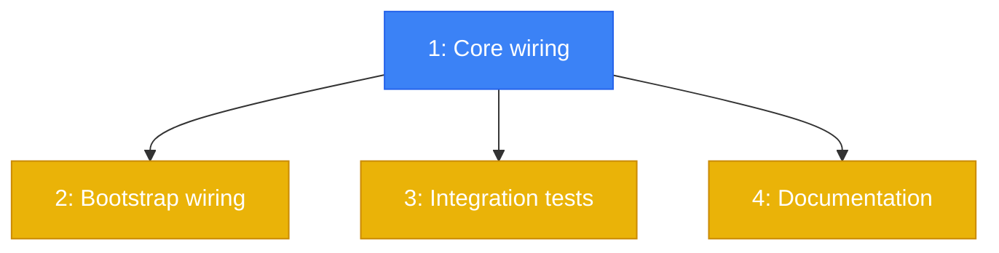

# PLAN: Wire Prompt Injection Guard into Runtime

## Status

Draft

## Scope Summary

Wire the existing PromptGuard into `MessageRouter.route()` via a
`guardAndDispatch()` method that screens LLM-bound intents selectively, blocks
at autonomy L3+, logs at L0-L2, and audits all triggers. Configurable
threshold via env var. 20 new tests across 2 files.

## Decomposition Strategy

**Horizontal decomposition.** This is a wiring change to existing code, not a
new end-to-end feature. Components have clear boundaries: type definitions,
router logic, bootstrap config, tests, and docs. Each layer builds on the
previous without integration risk.

## Issue Outlines

### Issue 1: feat(core): add LLM_BOUND_INTENTS, guardAndDispatch, and env var threshold

**Complexity:** testable
**Complexity rationale:** Core logic change with multiple code paths (selective enforcement, autonomy gating, audit logging). Must be verified.

#### Goal

Add the `LLM_BOUND_INTENTS` set and `PROMPT_GUARD_BLOCK_AUTONOMY` constant to
`intent.ts`. Update `MessageRouter` to accept optional `StorageProvider` and
`PromptGuard` via constructor. Add the private `guardAndDispatch()` and
`auditPromptGuard()` methods. Replace all 4 direct `handleMessage()` calls in
`route()` with `guardAndDispatch()`. Update the default `promptGuard` singleton
to read and clamp `PROMPT_GUARD_THRESHOLD` from the environment.

#### Acceptance Criteria

- [ ] `LLM_BOUND_INTENTS` exported from `packages/core/src/types/intent.ts` with exactly: `instruct`, `fix`, `plan`, `spec`, `lens`, `unknown`
- [ ] `PROMPT_GUARD_BLOCK_AUTONOMY` exported from `intent.ts` as `AutonomyLevel = 3`
- [ ] `MessageRouter` constructor accepts optional `StorageProvider` and `PromptGuard`
- [ ] All 4 dispatch paths in `route()` call `guardAndDispatch()` instead of `handleMessage()` directly
- [ ] `guardAndDispatch()` skips guard for non-LLM-bound intents
- [ ] `guardAndDispatch()` blocks at autonomy >= L3 with generic message: `"[codespar] Message blocked by security policy."`
- [ ] `guardAndDispatch()` logs but does not block at autonomy < L3
- [ ] `auditPromptGuard()` writes audit entry with action `prompt_guard.blocked` or `prompt_guard.flagged`
- [ ] `auditPromptGuard()` uses `result: "denied"` for blocked, `result: "success"` for flagged
- [ ] Audit entry metadata includes: `riskScore`, `triggers`, `intent`, `autonomyLevel`, `channel`, `textPreview`
- [ ] Default `promptGuard` singleton reads `PROMPT_GUARD_THRESHOLD` env var, clamped to `[0, 1]`
- [ ] Existing 26 PromptGuard unit tests still pass
- [ ] TypeScript compiles without errors in strict mode
- [ ] All existing MessageRouter tests still pass

#### Dependencies

None

---

### Issue 2: feat(core): pass storage to MessageRouter in server bootstrap

**Complexity:** simple
**Complexity rationale:** One-line change in the bootstrap code to pass the existing storage provider to the router constructor.

#### Goal

Update the server bootstrap (`server/start.mjs` or `packages/channels/cli/src/index.ts`)
to pass the org storage provider to `MessageRouter` so audit logging is active
in production.

#### Acceptance Criteria

- [ ] `MessageRouter` receives a `StorageProvider` instance at construction time
- [ ] Audit logging is active when the server starts (verify via logs with a test injection)
- [ ] No change to the `MessageRouter` API surface beyond what Issue 1 added

#### Dependencies

Issue 1

---

### Issue 3: test(core): add prompt guard wiring integration tests

**Complexity:** testable
**Complexity rationale:** 20 new tests across 2 files verifying wiring, selective enforcement, autonomy gating, audit trail, and threshold configuration.

#### Goal

Write the full test suite defined in the design's Testing section. Two test
files with real PromptGuard (no mocking of the guard itself).

#### Acceptance Criteria

**`packages/core/src/router/__tests__/message-router-guard.test.ts` (13 tests):**

Wiring (4 tests):
- [ ] Safe message with LLM-bound intent routes to agent normally
- [ ] Known injection with `instruct` intent at L3 returns blocked response
- [ ] Blocked response text is generic ("security policy"), does not leak trigger names
- [ ] Agent's `handleMessage` is never called when blocked

Selective enforcement (3 tests):
- [ ] Known injection with `status` intent routes to agent (non-LLM-bound skipped)
- [ ] Known injection with `deploy` intent routes to agent (structured command skipped)
- [ ] Known injection with `unknown` intent at L3 is blocked (SmartResponder path guarded)

Autonomy gating (3 tests):
- [ ] Known injection at L2 routes to agent (log-only)
- [ ] Known injection at L3 is blocked
- [ ] Known injection at L0 routes to agent

Audit trail (3 tests):
- [ ] Blocked message writes audit entry with action `prompt_guard.blocked`
- [ ] Flagged-but-not-blocked message writes audit with `prompt_guard.flagged`
- [ ] Safe message with no triggers does not write audit entry

**`packages/core/src/server/routes/__tests__/chat-guard.test.ts` (4 tests):**
- [ ] POST /api/chat with safe message returns normal response
- [ ] POST /api/chat with injection returns blocked response
- [ ] POST /api/chat/stream with safe message streams normally
- [ ] POST /api/chat/stream with injection sends error event and closes

**Threshold configuration (3 tests, in message-router-guard.test.ts):**
- [ ] Threshold 0.5 blocks medium-risk messages
- [ ] Threshold 0.99 allows most injections
- [ ] Default threshold 0.7 matches expected behavior

- [ ] All 20 new tests pass
- [ ] Existing 26 PromptGuard unit tests unaffected

#### Dependencies

Issue 1

---

### Issue 4: docs(guides): update prompt guard documentation

**Complexity:** simple
**Complexity rationale:** Documentation update to an existing MDX page. No code changes.

#### Goal

Update `apps/docs/content/docs/guides/prompt-guard.mdx` to document the
runtime wiring, selective enforcement behavior, autonomy-gated blocking,
threshold configuration, and limitations.

#### Acceptance Criteria

- [ ] Doc explains which intents are screened (LLM-bound only) and why
- [ ] Doc explains autonomy-gated behavior (log at L0-L2, block at L3+)
- [ ] Doc explains `PROMPT_GUARD_THRESHOLD` env var with valid range [0, 1]
- [ ] Doc includes honest limitations section (regex-based, bypassable by paraphrasing/encoding)
- [ ] Doc builds without errors (`npm run build` in apps/docs)

#### Dependencies

Issue 1

## Dependency Graph

**Legend:** Blue = ready to start, Yellow = blocked by dependency

## Implementation Sequence

**Critical path:** Issue 1 (core wiring) -- everything depends on it.

**Parallelization:** After Issue 1 completes, Issues 2, 3, and 4 can all be
worked in parallel. In practice, since this is a single PR, the natural order
is: 1 -> 2 -> 3 -> 4, committing incrementally.

**Estimated scope:** ~150 lines of production code, ~300 lines of tests,
~50 lines of docs. Small enough for one focused session.
