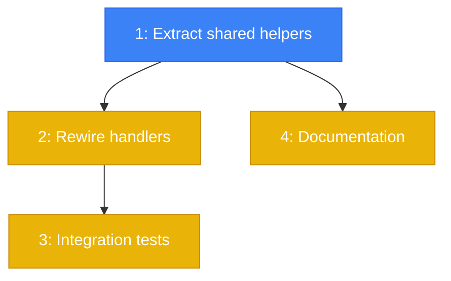

# PLAN: Enforce Webhook Signature Verification

## Status

Draft

## Scope Summary

Extract shared webhook verification helpers, add `WEBHOOK_STRICT_MODE` env
var (default false), fix Vercel timing attack, eliminate duplicate code.
12 new tests.

## Decomposition Strategy

**Horizontal decomposition.** The shared helpers must exist before the
handlers can use them, and the handlers must be rewired before tests can
verify the new behavior. Clean layer-by-layer build.

## Issue Outlines

### Issue 1: feat(core): extract shared webhook verification helpers

**Complexity:** testable
**Complexity rationale:** Core security logic with multiple code paths (strict/non-strict, three algorithms). Must be verified.

#### Goal

Create `packages/core/src/server/webhook-auth.ts` with
`verifyWebhookSignature(payload, signature, secret, algorithm, prefix?)`
and `enforceWebhookSecret(secret, provider, reply, log)`. The verification
function uses `timingSafeEqual` for all algorithms. The enforcement gate
reads `WEBHOOK_STRICT_MODE` from env.

#### Acceptance Criteria

- [ ] `verifyWebhookSignature` handles SHA256 (GitHub, Sentry) and SHA1 (Vercel)
- [ ] `verifyWebhookSignature` uses `timingSafeEqual` for all algorithms
- [ ] `verifyWebhookSignature` handles optional prefix (e.g., `"sha256="` for GitHub)
- [ ] `enforceWebhookSecret` returns `true` when secret is present
- [ ] `enforceWebhookSecret` rejects with 401 when no secret and `WEBHOOK_STRICT_MODE=true`
- [ ] `enforceWebhookSecret` logs warning and returns `false` when no secret and strict mode off
- [ ] Both functions exported from `@codespar/core` index
- [ ] TypeScript compiles without errors

#### Dependencies

None

---

### Issue 2: refactor(core): rewire webhook handlers to use shared helpers

**Complexity:** testable
**Complexity rationale:** Modifies security-critical code paths in 3 handlers. Must not break existing verification.

#### Goal

Update all three webhook handlers in `webhooks.ts` to use
`enforceWebhookSecret` and `verifyWebhookSignature` from `webhook-auth.ts`.
Fix Vercel to use constant-time comparison via the shared helper. Remove the
duplicate `verifyGitHubSignature` from `webhook-server.ts`.

#### Acceptance Criteria

- [ ] GitHub handler uses `enforceWebhookSecret` + `verifyWebhookSignature("sha256", "sha256=")`
- [ ] Vercel handler uses `enforceWebhookSecret` + `verifyWebhookSignature("sha1")`
- [ ] Sentry handler uses `enforceWebhookSecret` + `verifyWebhookSignature("sha256")`
- [ ] Vercel no longer uses `!==` for signature comparison (timing attack fixed)
- [ ] Duplicate `verifyGitHubSignature` removed from `webhook-server.ts`
- [ ] All three handlers follow the same pattern: resolve secret, enforce, verify
- [ ] Existing behavior preserved: when no secret and non-strict, webhooks still process
- [ ] TypeScript compiles without errors

#### Dependencies

Issue 1

---

### Issue 3: test(core): add webhook verification integration tests

**Complexity:** testable
**Complexity rationale:** 12 new tests covering security-critical verification logic.

#### Goal

Write `packages/core/src/server/__tests__/webhook-auth.test.ts` with 12
tests covering `verifyWebhookSignature`, `enforceWebhookSecret` in both
strict and non-strict modes, and HTTP-level integration.

#### Acceptance Criteria

**verifyWebhookSignature (4 tests):**
- [ ] Valid SHA256 signature passes
- [ ] Valid SHA1 signature passes
- [ ] Invalid signature is rejected
- [ ] SHA256 with "sha256=" prefix passes (GitHub format)

**enforceWebhookSecret strict mode on (3 tests):**
- [ ] No secret sends 401 response
- [ ] 401 response includes provider name
- [ ] With secret returns true (proceed to verification)

**enforceWebhookSecret strict mode off (3 tests):**
- [ ] No secret returns false (allows request to proceed)
- [ ] Warning logged on every skipped verification
- [ ] With secret returns true

**HTTP integration (2 tests):**
- [ ] GitHub webhook with valid signature succeeds end-to-end
- [ ] Vercel verification uses constant-time comparison (timing-safe)

- [ ] All 12 new tests pass
- [ ] All pre-existing tests unaffected

#### Dependencies

Issue 2

---

### Issue 4: docs(guides): document WEBHOOK_STRICT_MODE

**Complexity:** simple
**Complexity rationale:** Documentation update to an existing MDX page.

#### Goal

Update `apps/docs/content/docs/guides/webhook-monitoring.mdx` to document
the `WEBHOOK_STRICT_MODE` env var, the verification behavior when secrets
are and aren't configured, and the known limitations (raw body
reconstruction, no replay protection).

#### Acceptance Criteria

- [ ] Doc explains `WEBHOOK_STRICT_MODE` (default false, set true for internet-facing deployments)
- [ ] Doc explains what happens when no secret is configured (strict: 401, non-strict: warning)
- [ ] Doc lists the secret env vars for all three providers
- [ ] Doc mentions the Vercel timing-safe fix
- [ ] Doc includes known limitations (raw body reconstruction, no replay protection)

#### Dependencies

Issue 1

## Dependency Graph

**Legend:** Blue = ready to start, Yellow = blocked by dependency

## Implementation Sequence

**Critical path:** Issue 1 -> Issue 2 -> Issue 3

**Parallelization:** After Issue 1, Issue 4 (docs) can run in parallel with
Issue 2. After Issue 2, Issue 3 (tests) starts.

**Estimated scope:** ~80 lines new code (`webhook-auth.ts`), ~60 lines
modified (`webhooks.ts`, `webhook-server.ts`), ~200 lines tests, ~50 lines
docs.
